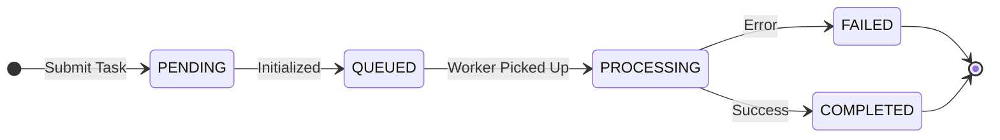

# API Reference Guide - Content search

This document defines the communication protocol between the Frontend and Backend for asynchronous file processing tasks.

---

## Global Response Specification

All HTTP Response bodies must follow this unified JSON structure:

| Field | Type | Required | Description |
| :--- | :--- | :--- | :--- |
| **code** | Integer | Yes | Application Logic Code. 20000 indicates success; others are logical exceptions. |
| **data** | Object/Array | Yes | Application data payload. Returns {} or [] if no data is available. |
| **message** | String | Yes | Human-readable message for frontend display (e.g., "Operation Successful"). |
| **timestamp** | Long | Yes | Server-side current Unix timestamp. |

### Response Example
```
HTTP/1.1 200 OK
Content-Type: application/json

{
  "code": 20000,
  "data": { "task_id": "0892f506-4087-4d7e-b890-21303145b4ee" },
  "message": "Operation Successful",
  "timestamp": 167890123
}
```
---

## Status Codes and Task

### HTTP Status Codes (Network Layer)
| Code | Meaning | Frontend Handling Suggestion |
| :--- | :--- | :--- |
| 200 | OK | Proceed to parse Application Layer code. |
| 201 | Created | Resource successfully created and persisted in the database. |
| 202 | Accepted | Task accepted for the backend. |
| 401 | Unauthorized | Token expired; clear local storage and redirect to Login. |
| 403 | Forbidden | Insufficient permissions for this resource. |
| 422 | Unprocessable Entity | Parameter validation failed (e.g., wrong file format). |
| 500 | Server Error | System crash; display "Server is busy, please try again". |

### Application Layer Codes (code field)
| Application Code | Semantic Meaning | Description |
| :--- | :--- | :--- |
| 20000 | SUCCESS | Task submitted or query successful. |
| 40001 | AUTH_FAILED | Invalid username or password. |
| 50001 | FILE_TYPE_ERROR | Unsupported file format (Allowed: mp4, mov, jpg, png, pdf). |
| 50002 | TASK_NOT_FOUND | Task ID does not exist or has expired. |
| 50003 | PROCESS_FAILED | Internal processing error (e.g., transcoding failed). |

---
### Task Lifecycle & Status Enum
The `status` field in the response follow this lifecycle:

| Status | Meaning | Frontend Action |
| :--- | :--- | :--- |
| PENDING | Task record created in DB. | Continue Polling. |
| QUEUED | Task is in the background queue, waiting for a worker. | Continue Polling. |
| PROCESSING | Task is currently being handled (e.g., transcoding). | Continue Polling (Show progress if available). |
| COMPLETED | Task finished successfully. | Stop Polling & Show Result. |
| FAILED | Task encountered an error. | Stop Polling & Show Error Message. |

### State Transition Diagram


## Core Endpoints

### Endponts table

| Endpoint | Method | Pattern | Description | Status |
| :--- | :---: | :---: | :--- | :---: |
| `/api/v1/system/health` | **GET** | SYNC | Backend app health check | DONE |
| `/api/v1/task/query/{task_id}` | **GET** | SYNC | Query status of a specific task | DONE |
| `/api/v1/task/list` | **GET** | SYNC | Query tasks by conditions (e.g., `?status=PROCESSING`) | DONE |
| `/api/v1/task/cancel/{task_id}` | **POST** | SYNC | Cancel a running task | WIP |
| `/api/v1/task/pause/{task_id}` | **POST** | SYNC | Pause a running task | WIP |
| `/api/v1/task/resume/{task_id}` | **POST** | SYNC | Resume a paused task | WIP |
| `/api/v1/object/files` | **GET** | SYNC | Query files in MinIO with filters | DONE |
| `/api/v1/object/upload` | **POST** | ASYNC | Upload a file to MinIO | DONE |
| `/api/v1/object/ingest` | **POST** | ASYNC | Ingest a specific file from MinIO | WIP |
| `/api/v1/object/ingest-text` | **POST** | ASYNC | Emedding a raw text | WIP |
| `/api/v1/object/upload-ingest` | **POST** | ASYNC | Upload to MinIO and trigger ingestion | DONE |
| `/api/v1/object/search` | **POST** | ASYNC | Search for files based on description | DONE |
| `/api/v1/object/download` | **POST** | STREAM | Download file from MinIO | DONE |
| `/api/v1/video/summarization` | **POST** | STREAM | Generate video summarization | WIP |

### Get Task List

* URL: /api/v1/task/list

* Method: GET

* Pattern: SYNC

Query Parameters:
| Parameter | Type    | Required | Default | Description                                         |
| :-------- | :------ | :------- | :------ | :-------------------------------------------------- |
| `status`  | string  | No       | None    | Filter by: `QUEUED`, `PROCESSING`, `COMPLETED`, `FAILED` |
| `limit`   | integer | No       | 100     | Max number of tasks to return (Min: 1, Max: 1000)   |

Request:
```
curl --location 'http://127.0.0.1:8000/api/v1/task/list?status=COMPLETED&limit=2'
```
Response (200 OK)
```json
{
    "code": 20000,
    "data": [
        {
            "status": "COMPLETED",
            "payload": {
                "source": "minio",
                "file_key": "runs/f52c2905-fb78-4ddd-a89e-9fb673546740/raw/application/default/apple_loop100.h265",
                "bucket": "content-search",
                "filename": "apple_loop100.h265",
                "run_id": "f52c2905-fb78-4ddd-a89e-9fb673546740"
            },
            "result": {
                "message": "File from MinIO successfully processed. db returns {}"
            },
            "progress": 0,
            "task_type": "file_search",
            "id": "56cc417c-9524-41a9-a500-9f0c44a05eac",
            "user_id": "admin",
            "created_at": "2026-03-24T12:50:34.281421"
        },
        {
            "status": "COMPLETED",
            "payload": {
                "source": "minio",
                "file_key": "runs/2949cc0e-a1aa-4001-aa0f-8f42a36c3e7c/raw/application/default/apple_loop100.h265",
                "bucket": "content-search",
                "filename": "apple_loop100.h265",
                "run_id": "2949cc0e-a1aa-4001-aa0f-8f42a36c3e7c"
            },
            "result": {
                "message": "File from MinIO successfully processed. db returns {}"
            },
            "progress": 0,
            "task_type": "file_search",
            "id": "8032db45-129b-4474-8d58-122f33661f19",
            "user_id": "admin",
            "created_at": "2026-03-24T12:48:13.301178"
        }
    ],
    "message": "Success",
    "timestamp": 1774330753
}
```
### Task Status Polling
Used to track the progress and retrieve the final result of a submitted task.

* URL: /api/v1/task/query/{task_id}

* Method: GET

* Pattern: SYNC

Request:
```
curl --location 'http://127.0.0.1:8000/api/v1/task/query/56cc417c-9524-41a9-a500-9f0c44a05eac'
```

Response (200 OK):
```json
{
    "code": 20000,
    "data": {
        "task_id": "371109e5-d374-4064-ba72-8f61b999d824",
        "status": "COMPLETED",
        "progress": 100,
        "result": {
            "summary": "This is a mock result from the local Dummy service for None.",
            "confidence": 0.98,
            "provider": "Mock-Windows-Service"
        }
    },
    "message": "Query successful",
    "timestamp": 1773907521
}
```

### File Upload
Used to upload a video file and initiate an asynchronous background task.

* URL: /api/v1/object/upload
* Method: POST
* Content-Type: multipart/form-data
* Payload: file (Binary)
* Pattern: ASYNC

Request:
```
curl --location 'http://127.0.0.1:8000/api/v1/object/upload' \
--form 'file=@"/C:/videos/videos/car-detection-2min.mp4"'
```
Response (200 OK):
```json
{
    "code": 20000,
    "data": {
        "task_id": "c68211de-2187-4f52-b47d-f3a51a52b9ca",
        "status": "QUEUED"
    },
    "message": "File received, processing started.",
    "timestamp": 1773909147
}
```

### File ingestion
* URL: /api/v1/object/ingest
* Method: POST
* Pattern: ASYNC
Request:
```
// todo
```
Response:
```json
// todo
```

### File upload ana ingestion
* URL: /api/v1/object/upload-ingest
* Method: POST
* Content-Type: multipart/form-data
* Pattern: ASYNC

Request:
```
curl --location 'http://127.0.0.1:8000/api/v1/object/upload-ingest' \
--form 'file=@"/C:/videos/videos/car-detection-2min.mp4"'
```
Response (200 OK):
```json
{
    "code": 20000,
    "data": {
        "task_id": "e458add3-bf5c-48f1-9593-4b72481bdca5",
        "status": "QUEUED",
        "file_key": "runs/5a477a66-bf88-4ebb-8cb6-0058811f5836/raw/video/default/car-detection-2min.mp4"
    },
    "message": "Upload and Ingest started",
    "timestamp": 1773909831
}
```
### Resource Lookup (Video/Image/Document)
Retrieve file metadata or direct access links for existing resources.

* URL: /api/v1/object/files/{resource_id}
* Method: GET
* Pattern: SYNC

Response (200 OK):
```json
{
  "code": 20000,
  "data": {
    "resource_id": "res-999",
    "type": "video",
    "name": "tutorial_01.mp4",
    "url": "https://cdn.example.com/files/tutorial_01.mp4",
    "created_at": 1709184000
  },
  "message": "Resource found",
  "timestamp": 1709184100
}
```
