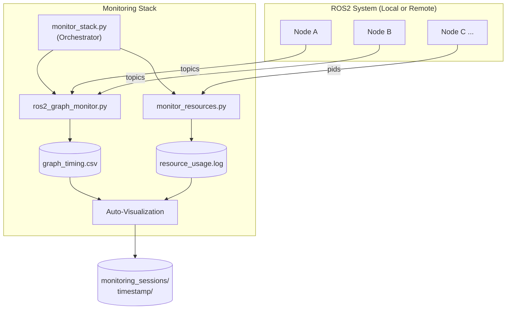
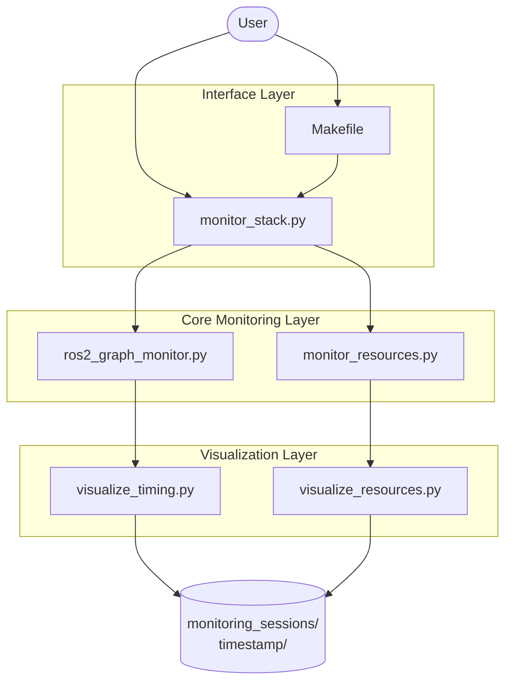
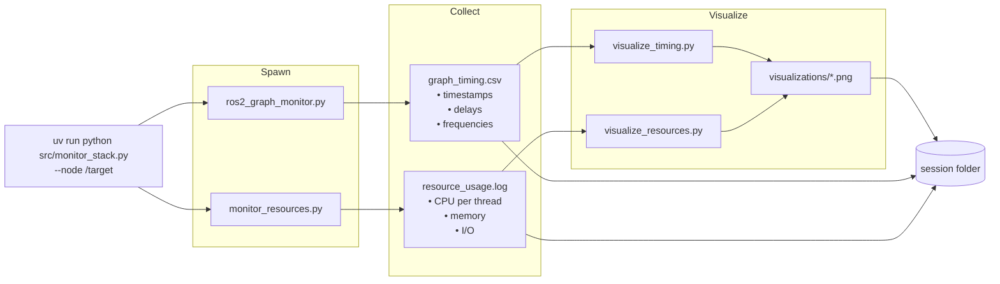
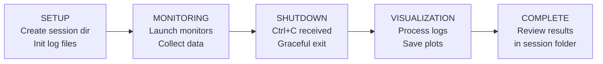

<!--
Copyright (C) 2026 Intel Corporation

SPDX-License-Identifier: Apache-2.0

These contents may have been developed with support from one or more
Intel-operated generative artificial intelligence solutions.
-->
# Architecture Overview

## System Architecture



---

## Component Interaction



---

## Data Flow



---

## Session Lifecycle



---

## File Organization

```
monitoring_sessions/
│
├── <timestamp>/              # Auto-generated session
│   ├── session_info.txt     # Metadata: time, node, options
│   ├── graph_timing.csv     # Raw timing data
│   ├── resource_usage.log   # Raw resource data
│   └── visualizations/      # Generated plots
│       ├── timing_*.png
│       └── resource_*.png
│
└── <custom_name>/           # Named session (--session flag)
    └── ... (same structure)
```

---

## Design Principles

| Principle | Description |
|-----------|-------------|
| Single Responsibility | Each script does one thing: orchestrate, monitor graph, monitor resources, or visualize |
| Composability | Scripts work independently or together via the orchestrator |
| Graceful Degradation | If one monitor fails, the other continues; raw data is always preserved |
| User Experience First | One command covers the common case; automatic session organization |
| Data Preservation | Raw data always saved; visualizations can be regenerated at any time |
